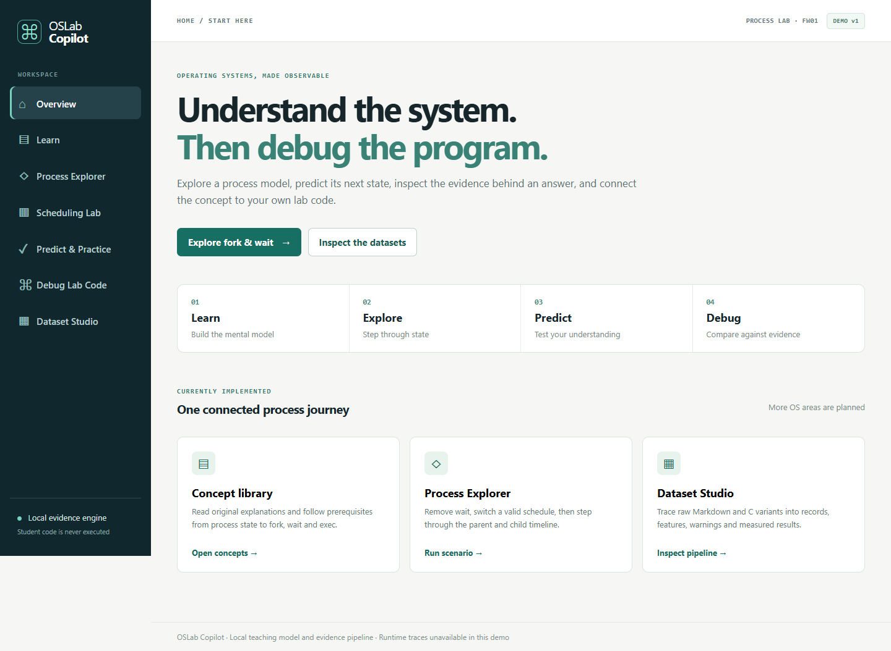
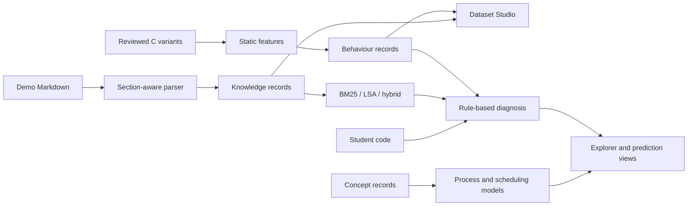

# OSLab Copilot

**Learn an OS mechanism, inspect a deterministic model, predict the next state, and connect it to program evidence.** OSLab Copilot is a local Operating Systems learning and diagnostic environment. The current release has a focused process journey, a CPU scheduling workbench, a Dataset Studio, and the original evidence based fork/wait debugger.

The project began as a lab diagnostic prototype. Its two datasets remain central: structured instructional records describe expected behaviour, while reviewed C failure cases supply source based behavioural evidence. The interface exposes the processing path and diagnostic signals. Student code is never executed by the web app.



[Process Explorer](docs/images/process-explorer.png) · [Scheduling Lab](docs/images/scheduling-lab.png) · [Dataset Studio](docs/images/dataset-studio.png)

## Run locally

Requires Python 3.10+ and scikit-learn. From the repository root:

```powershell
python -m pip install -r requirements.txt
python -m oslab build
python -m oslab evaluate
python -m oslab serve --port 8000
```

Open <http://127.0.0.1:8000>. Run the tests with `python -m unittest discover -s tests -v`. The app binds to localhost. It does not need credentials or an LLM. `python -m oslab inspect knowledge` and `python -m oslab inspect behaviour` print the generated working datasets.

### Suggested five minute demo

1. Open **Dataset Studio**. Select `fork_wait.md` to see the raw document, detected headings, processed records and metadata. Select `missing_wait_a` in the behaviour corpus to see its source difference, static features, and the empty runtime evidence field.
2. Open **Learn → Waiting for a child** and inspect the claims, misconceptions, linked records and official reference.
3. Open **Process Explorer**. Step through the wait case, remove wait, switch the schedule, and compare the valid output orders. The model is explicitly labelled as a teaching simulation.
4. Open **Predict & Practice** and predict the event after fork. The same model grades the answer.
5. Open **Debug Lab Code**, load the missing-wait example, analyse it, and follow **Open visual explanation** back to the explorer.
6. Open **Scheduling Lab**. Run FCFS, SJF, and Round Robin on the sample workload; step through events or view the final Gantt timeline and metrics.

## Implemented now

| Area | Working capability |
|---|---|
| Knowledge corpus | Three original synthetic Markdown experiment files; 21 section aware records with source and content hashes |
| Behaviour corpus | One source reviewed fork/wait reference and four controlled failure variants; static evidence only on this Windows machine |
| Dataset Studio | Raw sources, heading positions, processed records, hashes, source diffs, evidence labels, health checks and dataset fingerprint |
| Retrieval | BM25, dense **LSA** (TF-IDF bigrams plus truncated SVD), and reciprocal rank fusion with experiment filtering |
| Process learning | Original concept records, prerequisite links, deterministic fork/wait frames, two valid no-wait schedules and model-based prediction feedback |
| Scheduling | Deterministic CPU-only FCFS, nonpreemptive SJF and Round Robin with ready queue, Gantt timeline and waiting/turnaround/response calculations |
| Diagnosis | Fork/wait rules and interpretable case matches, with retrieved instructional evidence and a link to the visual lesson |
| Evaluation | Labelled processing, retrieval and small diagnostic benchmarks; scenario tests for process and scheduling models |

No neural embedding model, LLM explanation provider, arbitrary code sandbox, Linux runtime trace, synchronization playground, memory visualizer or file-system explorer is implemented in this release. Exec and pipe have instructional retrieval but no behaviour diagnosis.

## Architecture



The process explorer and prediction endpoint use the same state transitions. The scheduling workbench uses a separate deterministic CPU model with the same event/frame presentation contract. The models are teaching abstractions; they do not claim to reproduce a real Linux scheduler or a student's execution. The LLM is absent by design: all state changes, calculations and grades are deterministic.

See [architecture](docs/architecture.md), [dataset design](docs/dataset.md), [evaluation](docs/evaluation.md), and [implementation status](docs/IMPLEMENTATION_STATUS.md) for details and limitations. The [05 October submission report](docs/SUBMISSION_CURRENT_STATUS_2026-10-05.md) is a preserved snapshot of the earlier prototype, before the learning modules were added.

## Datasets and measured results

`python -m oslab build` writes local working copies to ignored `data/processed/` and tracked public demo snapshots to `results/`. `results/dataset_audit.json` records the pipeline, source hashes, section line numbers, metadata, source diffs and health checks. Only synthetic and original public demo material is loaded. `data/private/` and `data/university/` are gitignored; private course documents must stay there and are never loaded automatically into public snapshots.

`python -m oslab evaluate` regenerates the tracked result files. The current **processing** benchmark labels 21 headings in three simple Markdown sources; heading precision and recall, experiment ID accuracy and metadata completeness are all 1.000 on that limited set. No PDF, OCR or external document extraction is evaluated.

The 12-query retrieval benchmark reproduced these values:

| Method | Recall@3 | MRR@10 | nDCG@10 |
|---|---:|---:|---:|
| BM25 | 0.917 | 0.701 | 0.777 |
| LSA dense | 0.833 | 0.722 | 0.791 |
| Hybrid | 1.000 | 0.847 | 0.886 |

The leave-one-failure-case-out benchmark produced 4/4 Top-1 and 4/4 Top-3 matches across two closely related static failure families. This is a regression smoke test, not general diagnostic accuracy. Per-query ranks and per-case predictions are in `results/`. The concept library has six original records; it is currently separate from the 21 lab retrieval records, with links where the topics overlap.

## Security and evidence limits

The browser sends pasted code to the local static analyser, never to a compiler or execution engine. The optional `python -m oslab collect-trusted` command runs only fixed reviewed examples and requires Linux plus GCC; `strace` is used if present. It is not a student-code sandbox. All five committed behaviour cases therefore have `static_only` evidence and no runtime trace. Source inferred events, expected model events and user supplied output are labelled separately. The process model shows selected possible schedules, not all possible Linux interleavings. The scheduling model assumes CPU-only bursts, integer time, no I/O or context switch cost, and documented tie rules.

## Development direction

Next priorities are a larger rights-cleared concept corpus, stronger extraction with labelled PDF tests, broader and less correlated failure cases, a restricted Linux runtime environment, and deeper simulator connections to real code. Synchronization, memory and file descriptor models should be added only with independent correctness tests and a clear link to the same concept and evidence system. See [implementation status](docs/IMPLEMENTATION_STATUS.md).

## License

MIT for project code and original demo content; see [LICENSE](LICENSE). Linked external learning references retain their own terms.
