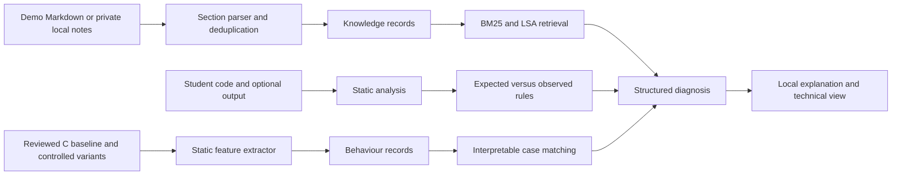

# OSLab Copilot

OSLab Copilot is a local demonstration of evidence based diagnosis for Operating Systems lab exercises. A normal retrieval chatbot can quote instructions, but it cannot establish what a student's program actually did. This project keeps instructional records and program failure records separate, extracts source signals, compares them with expected experiment behaviour, and produces a structured diagnosis before writing an explanation.

The current scope is a **static fork/wait diagnostic slice**. It does not claim that source inspection proves runtime order. Linux execution and tracing are available only as an optional collector for checked in trusted examples; this Windows development environment did not run those programs.

## Run

Requires Python 3.10+ and scikit-learn. From the repository root:

```powershell
python -m pip install -r requirements.txt
python -m oslab build
python -m oslab evaluate
python -m oslab serve --port 8000
```

Open <http://127.0.0.1:8000>. Tests: `python -m unittest discover -s tests -v`. Inspect processed records with `python -m oslab inspect knowledge` and `python -m oslab inspect behaviour`. Build writes demo dataset snapshots and evaluation writes metrics to tracked `results/`; local working copies are in gitignored `data/processed/`.

## Architecture



## Dataset collection and processing

The public demo has three synthetic Markdown experiment documents: fork/wait, exec, and pipe. The parser recognizes an experiment heading and named sections (Aim, Theory, Procedure, Program, Expected Output, Troubleshooting, Viva). It preserves each section as one record unless it exceeds 350 words, then splits within that section. Each record contains experiment ID and name, topic, section type, source filename, section position, language, SHA-256 text hash, and text. Identical sections in the same experiment are deduplicated. `data/demo/` is public synthetic material; place private university files in `data/private/` or `data/university/`, which are gitignored. The current parser accepts the documented Markdown structure, not arbitrary PDFs or scanned pages. Private material requires local conversion to this format and is never loaded automatically into the public demo.

The behaviour corpus includes one reference POSIX C program and two controlled variants each for missing wait and wait in the child branch. `python -m oslab build` persists source code, mutation, label, static features, expected events, explanation, and explicit unavailable fields for compiler output, runtime output, and trace. These are source reviewed examples, but compilation and runtime correctness have **not been verified on this Windows machine**. The optional `python -m oslab collect-trusted` command requires Linux and GCC. It compiles and runs only the fixed repository examples in a temporary directory, with a five second timeout, and records real output and optional `strace` events if installed. The default build command overwrites locally collected behaviour JSON, so run the collector after building when using Linux.

Trace normalization maps selected syscall names to event categories and removes volatile PIDs, descriptors, and timestamps. Static features include fork, wait, branch location of wait, exec, pipe, close count, and semaphore calls. The regex branch detector covers the demonstration C shapes; it is not a general C parser. User code submitted in the UI is **never compiled or run**. On this machine Docker and WSL are unavailable; there is no sandbox for arbitrary code.

## Retrieval and diagnosis

BM25 is implemented directly over tokenized sections. Dense retrieval uses TF-IDF bigrams followed by truncated SVD latent semantic analysis, producing compact dense vectors without a model download. This is a lightweight latent semantic model, not a pretrained sentence embedding model. Hybrid retrieval uses reciprocal rank fusion with a small mode specific section bonus. The experiment filter is exact. Results expose lexical, semantic, and fused scores; there is no separate reranker.

In Debug mode, rules compare expected fork/wait events with static evidence. Missing wait and wait in child produce specific diagnoses. Similar known cases are ranked by named matching feature signals; the UI shows those signals and source records. Pasted output is displayed as user supplied evidence, not treated as a trusted trace. The explanation is deterministic and grounded in the structured result. No LLM provider is integrated; `.env.example` reserves an optional future key but the app does not need it.

## Evaluation

Run `python -m oslab evaluate` to regenerate `results/retrieval_metrics.json` and `results/diagnostic_metrics.json`. The retrieval benchmark has 12 hand labeled queries over synthetic documents. It measures Recall@3, MRR@10, and nDCG@10 with one relevant section per query. The diagnostic benchmark leaves out one failure case at a time and matches it to the remaining cases using static features; it has four cases across two labels. The cases are close variants, so these scores are a smoke test of the pipeline, not evidence of generalization to unseen student programs. No behaviour only ablation is possible without Linux traces; no numbers for that condition are reported.

The checked run on this machine yielded:

| Retrieval | Recall@3 | MRR@10 | nDCG@10 |
|---|---:|---:|---:|
| BM25 | 0.917 | 0.701 | 0.777 |
| LSA dense | 0.833 | 0.722 | 0.791 |
| Hybrid | 1.000 | 0.847 | 0.886 |

Failure matching Top-1 and Top-3 were both 4/4 on the small leave-one-failure-case-out benchmark. Actual per-query ranks and per-case predictions are in the generated JSON artifacts.

## Security and limits

The HTTP service binds to localhost. It accepts at most 100 KB per request and runs no submitted code. The trusted Linux collector is an explicit command limited to reviewed checked in examples. It does not provide a container boundary. Linux traces were not collected here; normalized events are empty in the generated Windows behaviour dataset. The current diagnoses cover fork/wait only. Exec and pipe have instructional retrieval but no behaviour diagnosis. Future work includes a restricted Docker runner, broader failure cases, stronger C parsing, real Linux traces, a pretrained compact embedding model, and optional evidence constrained LLM wording.

## License

MIT; see [LICENSE](LICENSE).
