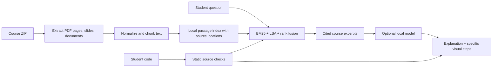

# OS Lab Companion

A local Operating Systems study tool built around the university course archive. Ask a theory question, review C or shell lab code, or run a CPU scheduling simulation. The data pipeline and analysis are part of this project; the local language model explains selected evidence and creates a question-specific visual walkthrough.

## Run locally

From this folder in PowerShell:

```powershell
python -m pip install -r requirements.txt
python -m oslab import-course "C:\Users\adita\Downloads\OS.zip"
python -m oslab serve --port 8001
```

Open <http://127.0.0.1:8001>. Keep this PowerShell window open. The archive only needs importing once unless its contents change. The course ZIP, extracted index, and model file stay in gitignored `data/private/`.

The app can show ranked source passages and static code findings without a model. To enable generated explanations and visual steps on this laptop, open a **second PowerShell window** in this folder and run `powershell -ExecutionPolicy Bypass -File .\start_model.ps1`; leave it open. This uses the downloaded local GGUF and llama.cpp runtime in `data/private/`. On a new machine, install [Ollama](https://ollama.com/download), run `ollama pull qwen3:4b-instruct`, and ensure its local server is running on port 11434. A llama.cpp server with a compatible GGUF model on port 8080 works too. Model status is shown in **Ask OS**. The model receives only selected passages and any code pasted into the local browser; no hosted API key is needed.

## A simple demo

1. **Ask OS:** enter `Why does a page fault happen?` Show the short explanation, step-by-step visual, and the source filename plus slide/page under it. Switch between hybrid, BM25, and LSA ranking if asked about retrieval.
2. **Review lab code:** paste a small C program that uses `pipe()` or `fork()` and ask what might go wrong. Show the source-based clues, related course excerpts, and code-specific visual. The app does not execute student code; findings are hypotheses to check.
3. **Scheduling lab:** run FCFS, SJF, and Round Robin on the same process workload. Show the timeline and waiting/turnaround metrics.
4. **How the data works:** show imported document and passage counts, expand the source inventory to show per-file passage counts and SHA-256 fingerprints, and inspect skipped files and the separate public lab datasets.

The current private archive produced **33 searchable documents and 553 passages** from PDFs, PPTX slides, and DOCX files. Search also includes **21 original project lab notes**, labeled separately in results. The importer skipped 21 archive entries, mostly unsupported older PowerPoint files and images. These are counts, not a relevance score.

## What happens behind the screen


```mermaid
flowchart LR
  ZIP[Course ZIP] --> EX[Extract PDF pages, slides, documents]
  EX --> CH[Normalize and chunk text]
  CH --> IDX[Local passage index with source locations]
  Q[Student question] --> RET[BM25 + LSA + rank fusion]
  IDX --> RET
  RET --> SRC[Cited course excerpts]
  SRC --> LLM[Optional local model]
  LLM --> OUT[Explanation + specific visual steps]
  CODE[Student code] --> STATIC[Static source checks]
  STATIC --> RET
  STATIC --> OUT
```

The importer preserves source filename, page/slide, passage text, and source SHA-256. It guards archive size and paths, skips unsupported files, and records why each file was skipped. Search combines lexical BM25 with LSA, a low-rank representation of local TF-IDF text, using reciprocal-rank fusion. **LSA here is statistical similarity, not a neural embedding model.** The source cards remain visible even if no model is running.

The code reviewer recognizes selected process, pipe, thread, mutex, exec, and shell clues and reports source line numbers. It builds a relevant search across course passages and labeled project notes from the code and the student's question, then asks the local model to explain likely issues with citations. Static checks inspect up to 20,000 characters; the model sees the first 6,000, and the UI flags either limit. This is not a compiler, a runtime trace, or proof that a particular bug occurred. For fork/wait questions, a more detailed deterministic process walkthrough is linked contextually; it is one topic in the wider OS course, not the app's main subject.

Visual steps are generated for retrieved theory questions, with a source number for each step. For the supported pipe/EOF loop pattern, a checked static walkthrough uses exact code lines and source notes because the local model sometimes invented descriptor operations. Other code reviews use the local model when its source and visual checks pass. These visuals explain a mechanism; they do not claim to replay the user's actual program. The deterministic scheduling lab computes results independently of the model.

## Evidence and limits

The private course archive has not been given a labeled relevance benchmark. The public synthetic dataset has separate labeled retrieval and diagnostic checks, described in [evaluation](docs/evaluation.md), but those numbers must not be presented as accuracy on the university archive. Scanned images and legacy `.ppt`/`.doc` are not extracted. The model can still make mistakes; inspect the cited passages before relying on an answer.

Run tests with `python -m unittest discover -s tests -q`. For a short presentation script and honest answers to likely questions, see the [review guide](docs/REVIEW_GUIDE.md).

The four-page [submission report](docs/SUBMISSION_REPORT_2026-10-12.pdf) covers dataset, preprocessing, implementation, controlled metrics, problems encountered, and a revised workflow. Its editable source is [HTML](docs/SUBMISSION_REPORT_2026-10-12.html).

## License

MIT for project code and original demo content; see [LICENSE](LICENSE). University material and model weights retain their own terms and are not committed.
