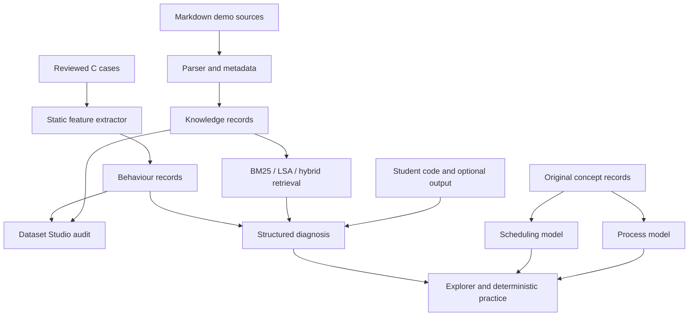

# Architecture

## Decision: keep evidence and model state separate

OSLab Copilot has three kinds of facts. **Expected** facts describe a teaching model or experiment requirement. **Inferred** facts come from static source analysis. **Observed** facts require a real run or a user-supplied output, labelled by its provenance. These are kept separate in the behaviour records and Debug response. A deterministic teaching simulation never becomes an observed student trace.

## Backend modules

- `oslab/knowledge.py` parses sectioned Markdown, deduplicates records and implements BM25, LSA and reciprocal rank fusion. The existing retrieval benchmark is held as a regression baseline.
- `oslab/behaviour.py` builds reviewed fork/wait case records, extracts selected source signals and normalizes supported syscall trace names. Its regexes cover demonstration patterns, not arbitrary C control flow.
- `oslab/studio.py` makes raw input, heading locations, source hashes, record metadata, source diffs and quality warnings inspectable. A 16-character dataset fingerprint hashes public source documents, reviewed case source and concept records. It is a change detector, not a release number.
- `oslab/concepts.py` validates unique concept IDs and prerequisites. Concept records contain original claims, misconceptions, linked demo records where available and URLs for further reading.
- `oslab/process_model.py` defines explicit events and a reducer for a small fork/wait teaching scenario. Each frame has an event, title, concept ID and state snapshot. Prediction grading uses this same model.
- `oslab/scheduling.py` independently models CPU-only FCFS, nonpreemptive SJF and Round Robin. It presents the same event/frame shape but keeps scheduling-specific state in its own module. A single universal OS reducer would add complexity without making either model more correct at this stage.
- `oslab/diagnose.py` combines experiment context, static signals, known failure matches and retrieved sections into a structured result before deterministic explanation text. A fork/wait diagnosis links to the relevant visual scenario.
- `oslab/__main__.py` serves the localhost UI and read-only dataset/model endpoints; it also handles validated analysis, practice and scheduling requests.

## Process-model scope

The parent and child state model supports a parent selected first or child selected first after `fork`. With `waitpid`, the parent's completion output follows the child's exit in both scenarios. Without it, the two selected schedules demonstrate both output orders. The model tracks whether the child has been reaped. It omits signals, multiple children, precise Linux scheduling, kernel internals, and reparenting details. Its snapshots are teaching states, not actual runtime observations.

## Scheduling-model scope

Input contains one to eight processes with integer arrivals and CPU bursts. FCFS and RR use input order for arrival ties; SJF selects the shortest ready burst with arrival and input order as tie breakers. RR preemption joins the queue before arrivals processed at the next integer time. The engine emits arrival, dispatch, CPU tick, preemption, completion and idle events. Waiting, turnaround and response metrics are derived from completion and first-start times. It omits I/O, context-switch overhead and priorities. The UI renders the engine's snapshots and reveals the Gantt timeline progressively.

## Security boundary

No HTTP request can reach a compile or run path. The trusted Linux collector is a separate explicit command limited to checked-in examples. It lacks a container boundary and must never be repurposed to execute pasted student code. The app binds to `127.0.0.1`. Private documents are excluded from the public build by its fixed `data/demo/` input path and by `.gitignore`.
